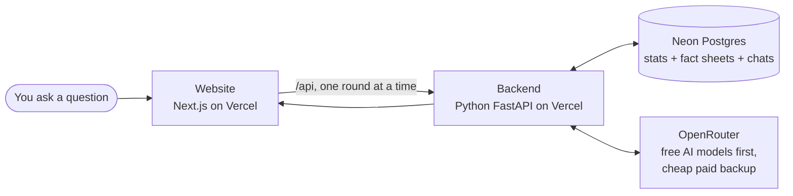
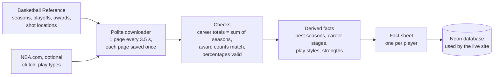
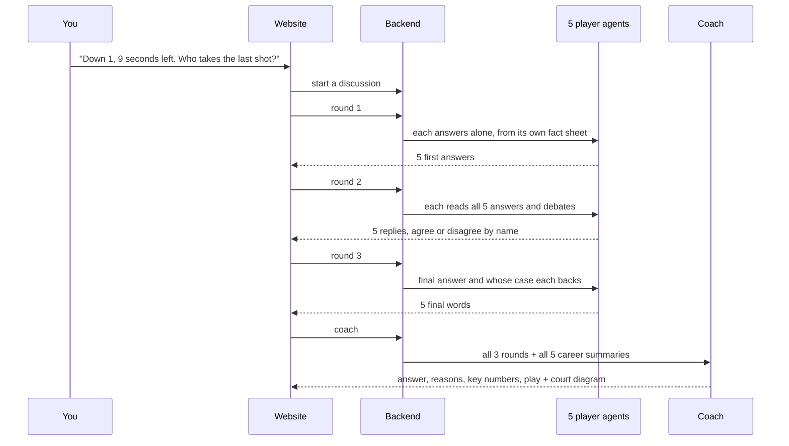
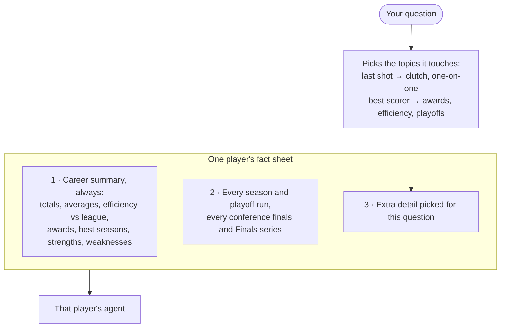

# HoopCouncil

**Try it live: [basketball-agents.vercel.app](https://basketball-agents.vercel.app/)**

Ask any basketball question and five AI agents answer it, one for each of **Stephen Curry, Kobe Bryant, Michael
Jordan, Kevin Durant and LeBron James**. Each agent argues only from its own player's real career stats. They answer,
debate each other and give a final word. Then an AI **Coach** reads the whole discussion and gives the council's
answer. If you asked about a play, the Coach also draws it on an animated basketball court.

> These are AI agents built from statistics, not the real players. Nothing they say is a real quote.

## The big picture



* **Website:** the chat, player pages and the *How it works* page.
* **Backend:** builds each agent's prompt from the database, calls the AI, checks the answers and saves the discussion.
* **Database:** every season, playoff run and award for the five players, plus a ready-made fact sheet per player.
* **AI:** OpenRouter gives access to many models through one key. Free models are tried first.

## Where the numbers come from (done once)



Nothing is typed in by hand or taken from the AI's own memory. Missing data stays missing: if a stat doesn't exist for
a season (shot locations before 1996-97, play types before 2015-16), the agent is told the data doesn't show it.

## What happens when you ask



| Round | What each agent does |
|---|---|
| 1. First answers | Answers alone, without seeing the others. Gives a position, the numbers behind it and the risks. |
| 2. Debate | Reads all five answers, says who it agrees or disagrees with by name, and may change its mind. |
| 3. Final word | Gives its final answer and says whose argument it backs. |
| Coach | Weighs the evidence, not the vote count, and gives the answer with the key numbers explained. For play questions it adds a full play call and the court steps that the diagram animates. |

The site runs one round per request because Vercel stops the backend after each response. If you close the tab
mid-discussion, it carries on when you open it again.

## What each agent sees



All five agents get the **same instructions and rules**. They differ in three ways only:

| | Curry | Kobe | Jordan | Durant | LeBron |
|---|---|---|---|---|---|
| **Data** | only Curry's | only Kobe's | only Jordan's | only Durant's | only LeBron's |
| **Angles it looks from** | spacing, shooting gravity, pick-and-roll | isolation, midrange, footwork, late clock | rim pressure, midrange, transition, defense | mismatches, pull-ups, punishing switches | playmaking, passing reads, running the offense |

The third difference is the **extra detail** each question pulls in: the same question picks different numbers for
each player, because their records differ and cover different years. An agent never sees another player's numbers; it only hears the other agents' arguments in round 2. The angles decide
what to look at, and the instructions say they're not a reason to pick its own player.

## The prompts

These are the instructions the backend sends, shortened here. The **[How it works](https://basketball-agents.vercel.app/how-it-works)**
page shows the exact, full versions live, with every `{blank}` explained. Every agent answers in JSON: its `message`
becomes the chat bubble, and the rest feeds the details panel and **Why did … say this?**

<details>
<summary><b>Player setup</b>: sent with every round, holds that player's fact sheet</summary>

```text
You speak for {name} in HoopCouncil, a group chat where five AI participants, each built from one player's
statistical career data, answer a fan's question together. You are not the real person: you argue {name}'s case
from his stored numbers, referring to him by name in the third person.

Your angle on any question comes from the CAREER CONTEXT below, viewed through these lenses: {focus}.
Use the lenses to decide what to look at, not as a reason to pick {name}.

CAREER CONTEXT ({name}, generated from the HoopCouncil database):
{context}

Write like a sharp analyst in a group chat: direct, specific, two to five sentences, with real numbers.
```
</details>

<details>
<summary><b>How to talk about the data</b>: so a fan who hasn't seen the stats can follow</summary>

```text
- Never say "my data" or "based on the profile" on their own. Always say which statistic, its value, and the span
  it covers: "<Player> made <N>% of his threes over <N> seasons".
- Explain terms a casual fan may not know: true shooting %, usage rate, BPM, win shares, "clutch".
- Give a comparison point when the context has one, such as the league average for the same seasons.
- Prefer two or three well-chosen numbers over a list.
```
</details>

<details>
<summary><b>Rules</b>: the same for every agent</summary>

```text
1. Prefer the supplied statistical data over your own memory of basketball history.
2. Never invent statistics. Every number must appear in the CAREER CONTEXT (or was already stated in this chat).
3. Never fabricate awards or career accomplishments.
4. If a relevant statistic is absent, say plainly that the stored data doesn't cover it.
5. Mark statistical facts "FACT: ..." and basketball inference "INFERENCE: ...".
6. Refer to every player by name in the third person. Never write "agent", never pretend to be the real person,
   never invent quotes.
7. Reason about winning basketball and the evidence, not reputation.
8. Do not automatically favour {name}. If the evidence points to someone else, say so.
9. You only have detailed data for {name}. Don't state statistics for the other four unless already said in chat.
```
</details>

<details>
<summary><b>Round 1</b>: first answers</summary>

```text
THE FAN ASKS: {question}
Round 1: answer on your own. You have not seen anyone else's answer.
Return JSON: message (2-5 sentences, 2-3 specific numbers explained), position, reasoning,
data_support ["FACT: ...", "INFERENCE: ..."], risks, play (only if the question asks for a play), confidence 0-100
```
</details>

<details>
<summary><b>Round 2</b>: debate</summary>

```text
ROUND 1 ANSWERS FROM ALL FIVE: {proposals}
Round 2: react to the others by name ("Kobe, ..."): what is right, what is missing, where the evidence disagrees.
Bring at least one number from {name}'s CAREER CONTEXT. Change your answer if someone made the better case.
Agreement is fine; do not invent disagreement.
Return JSON: message, evaluations [{of_player, stance: agree|partially_agree|disagree, comment}],
revised_position, changed_position, data_support, confidence
```
</details>

<details>
<summary><b>Round 3</b>: final word</summary>

```text
ROUND 1 ANSWERS: {proposals}   ROUND 2 CHAT: {debate}
Round 3: state your final answer and whose case you back, with the one number that settled it.
Return JSON: message (1-3 sentences), final_answer, backs (a player's full name), reason, confidence
```
</details>

<details>
<summary><b>Coach</b>: the final answer</summary>

```text
You are the Coach. Do not simply follow the majority. Weigh the evidence and the basketball logic.
Use only statistics in the five career summaries or quoted by the agents.

CAREER SUMMARIES: {contexts}
ROUND 1: {round1}   ROUND 2: {round2}   ROUND 3: {round3}

Return JSON: verdict (one headline sentence), answer (3-6 sentences, numbers explained), reasoning,
key_data_points, rejected_alternatives, vote_summary, confidence,
play (play name, ball handler, options, counter, each player's role) and
court (start positions + a 5-12 step sequence of screens, cuts, passes and the shot)
— play and court only when the question is about a play.
```
</details>

The players never see each other's confidence scores, only their arguments, so nobody is swayed by how sure someone
sounds. The Coach sees everything.

## Important questions

**Can the AI make up stats?**
It's told not to, and it only gets numbers from the checked database. Each number it cites is marked as a fact from
the data or a basketball opinion. Free models follow rules less reliably than paid ones, so **Why did … say this?**
under every message shows the exact data that reply was built from.

**Does the coach really draw the play?**
Yes, for questions about a play, a last shot or an action on the court. The coach returns step-by-step court
instructions, the backend keeps only valid steps (known positions and actions), and the court diagram animates them.
Comparison or career questions get no play and no court.

**What does it cost to run?**
Hosting on Vercel and Neon is free. Each question makes 16 AI calls through OpenRouter: free models first, and a cheap
paid model (about a cent per question) only when no free one answers. The live site allows up to 50 questions a day.

**Does it remember earlier questions?**
No. Each question is debated from scratch. Your chat stays on screen in your browser until you click **Clear chat**.

**What can't the data tell us?**
Older seasons have less detail: shot locations start in 1996-97 (so Jordan's cover only his last four seasons) and
play types in 2015-16. Regular-season game logs aren't collected. Each player's profile page lists these gaps.

## Built with

| Part | Technology |
|---|---|
| Website | Next.js 15, React 19, TypeScript, Tailwind CSS 4 |
| Backend | Python, FastAPI, SQLAlchemy |
| Database | PostgreSQL (Neon when hosted, Docker locally) |
| AI | OpenRouter (free models first, Llama 3.1 8B / 3.3 70B as paid backup); Ollama, Anthropic, OpenAI and Gemini also supported |
| Hosting | Vercel (website and backend in one project, see `vercel.json`) |
| Data | Basketball Reference, optional NBA.com stats |

```
backend/hoopcouncil/
  ingest/        polite downloader and parsers (Basketball Reference, NBA.com)
  quality/       data checks and per-player quality reports
  derive/        best seasons, career stages, play styles, strengths
  context/       fact sheets and picking detail for each question
  agents/        the prompts, the player and coach agents, answer clean-up, court checks
  orchestrator.py  the three rounds and the coach
  llm/           OpenRouter, Ollama, Anthropic, OpenAI, Gemini
  api/           the FastAPI backend
frontend/        the website
docs/            data sources, best-season formula, play-style rules
```

`cd backend && python -m pytest` runs 43 tests on synthetic data (no real statistics), covering the parsers, data
checks, fact sheets, prompts, a full mock debate, the round-by-round mode and the safety limits.
